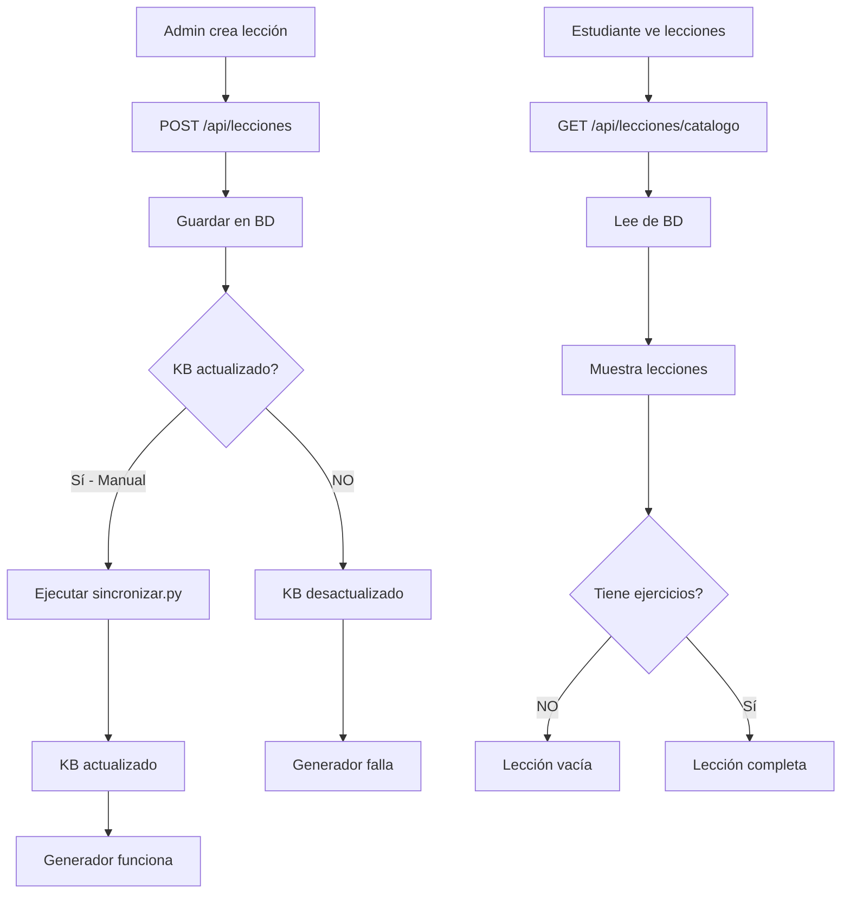

# Análisis de Integración: Lecciones Admin → Estudiante

**Fecha:** 2025-11-17
**Proyecto:** SpeakLexi 2.0
**Versión:** 1.0

---

## 📋 Resumen Ejecutivo

Este documento analiza la integración entre la creación de lecciones (admin) y su visualización (estudiante), identificando discrepancias críticas entre la Base de Datos (BD) y el Knowledge Base (KB), y proponiendo soluciones para unificar el flujo de datos.

### Hallazgos Principales

1. **🔴 CRÍTICO:** Doble fuente de verdad (BD + KB JSON)
2. **🟡 IMPORTANTE:** Scripts de sincronización Python manuales
3. **🟢 FUNCIONAL:** Backend lee de BD, frontend consume API
4. **⚠️ RIESGO:** KB no se actualiza automáticamente al crear lecciones

---

## 🔍 1. Arquitectura Actual

### 1.1 Flujo de Creación (Admin)

```
Admin UI (gestion-lecciones.js)
    ↓
POST /api/lecciones (crear)
    ↓
leccionController.crearLeccion()
    ↓
lecciones.js Model → INSERT INTO lecciones (BD)
    ↓
❌ KB NO SE ACTUALIZA (requiere script manual)
```

**Endpoints utilizados:**
- `POST /api/lecciones` - Crear lección (backend/controllers/leccionController.js:347)
- `GET /api/lecciones` - Listar todas (admin) (leccionController.js:403)
- `PUT /api/lecciones/:id` - Actualizar lección (leccionController.js:494)
- `DELETE /api/lecciones/:id` - Eliminar lección (leccionController.js:542)

**Campos almacenados en BD:**
```sql
lecciones {
    id, titulo, descripcion, contenido, nivel, idioma,
    duracion_minutos, orden, estado, creado_por, creado_en
}
```

### 1.2 Flujo de Visualización (Estudiante)

```
Estudiante UI (lecciones.js)
    ↓
GET /api/lecciones/catalogo?busqueda&limit&offset
    ↓
leccionController.obtenerCatalogo()
    ↓
BD → Filtrar por nivel e idioma del usuario
    ↓
Renderizar lecciones + estadísticas
```

**Endpoints utilizados:**
- `GET /api/lecciones/catalogo` - Catálogo filtrado por nivel/idioma del usuario (leccionController.js:12)
- `GET /api/lecciones/:id` - Detalle de lección (leccionController.js:459)
- `POST /api/lecciones/:id/progreso` - Registrar progreso (leccionController.js:589)
- `POST /api/lecciones/:id/completar` - Completar lección (leccionController.js:695)

**Datos retornados:**
```javascript
{
    lecciones: [...],
    total: 10,
    estadisticas_por_nivel: [...],
    usuario: { idioma, nivel },
    filtros_aplicados: { nivel, idioma, busqueda }
}
```

### 1.3 Knowledge Base (KB)

**Ubicación:** `backend/data/kb/kb_*.json`

**Archivos encontrados:**
- `kb_ingles.json` - Lecciones de inglés
- `kb_frances.json` - Lecciones de francés
- `kb_aleman.json` - Lecciones de alemán
- `kb_italiano.json` - Lecciones de italiano
- `kb_portuges.js` - ⚠️ Archivo vacío (1 línea)

**Estructura del KB:**
```json
{
  "Inglés": {
    "A1": {
      "Presentarse en el Idioma": {
        "vocabulario": [...],
        "verbos": [...],
        "adjetivos": [...],
        "frases_clave": [...],
        "gramatica": [...],
        "contextos": [...],
        "ejemplos": {
          "seleccion_multiple": [...],
          "verdadero_falso": [...],
          "completar_espacios": [...],
          "emparejamiento": [...]
        }
      }
    }
  }
}
```

**Uso actual del KB:**
- ✅ Generación de ejercicios (`generar-lecciones.py`)
- ❌ NO se actualiza al crear lecciones desde admin
- ❌ NO se consulta en tiempo real por el backend

---

## 🔴 2. Discrepancias Identificadas

### 2.1 Problema Principal: Doble Fuente de Verdad

| Aspecto | Base de Datos | Knowledge Base |
|---------|--------------|----------------|
| **Ubicación** | MySQL `lecciones` | `backend/data/kb/*.json` |
| **Actualización** | Automática (API) | Manual (scripts Python) |
| **Usado por** | Admin, Estudiante | Generador de ejercicios |
| **Contiene** | Metadata básica | Contenido pedagógico completo |
| **Sincronización** | ❌ Manual | ❌ Manual |

### 2.2 Discrepancias Específicas

#### A) Lecciones en BD pero NO en KB
**Problema:** Admin crea lección → Se guarda en BD → KB desactualizado → Generador no puede crear ejercicios

**Impacto:**
- ⚠️ Lecciones visibles sin ejercicios
- ⚠️ Generador falla al buscar en KB
- ⚠️ Estudiantes ven lecciones "vacías"

#### B) Lecciones en KB pero NO en BD
**Problema:** KB tiene contenido → BD no lo sabe → Estudiantes no ven la lección

**Impacto:**
- ⚠️ Contenido pedagógico desperdiciado
- ⚠️ Desincronización entre desarrollo y producción

#### C) Títulos diferentes entre BD y KB
**Problema:** Script `sincronizar.py` (línea 74) intenta hacer match, pero:
```python
# Busca match exacto de título
key = f"{leccion['idioma']}-{leccion['nivel']}-{leccion['titulo']}"
```
- Si el título cambia en BD, KB queda huérfano
- Si el título del KB no coincide exactamente, no hace match

### 2.3 Scripts de Sincronización Manual

**Archivos encontrados:**
- `backend/data/sincronizar.py` - Sincroniza BD ↔ KB
- `backend/data/generar-lecciones.py` - Genera ejercicios desde KB
- `backend/data/reordenar.py` - Reordena lecciones
- `backend/data/limpiar-duplicados.py` - Elimina duplicados
- `backend/data/test.py` / `test_2.py` - Scripts de prueba

**Problemas:**
1. ❌ Requieren ejecución manual
2. ❌ No hay automatización en flujo de creación
3. ❌ Propenso a errores humanos
4. ❌ No hay rollback automático
5. ❌ Logs dispersos y difíciles de auditar

---

## 📊 3. Análisis de Flujo de Datos

### 3.1 Flujo Actual (Problemático)



### 3.2 Puntos de Falla

1. **Creación de lección:**
   - ✅ Se guarda en BD
   - ❌ No se agrega al KB
   - ❌ No se generan ejercicios automáticamente

2. **Actualización de lección:**
   - ✅ Se actualiza en BD
   - ❌ KB puede quedar desincronizado
   - ❌ Ejercicios antiguos no se regeneran

3. **Eliminación de lección:**
   - ✅ Se elimina de BD
   - ❌ KB puede tener lección huérfana
   - ❌ Ejercicios quedan en BD (dependiendo de CASCADE)

4. **Visualización:**
   - ✅ Lee correctamente de BD
   - ⚠️ Puede mostrar lecciones sin contenido pedagógico

---

## 🎯 4. Impacto en la Experiencia del Usuario

### 4.1 Administrador

**Problemas:**
- ❌ No sabe si la lección tiene contenido pedagógico completo
- ❌ No hay feedback sobre sincronización con KB
- ❌ No puede validar que los ejercicios se generaron
- ⚠️ Workflow interrumpido (crear → esperar sync manual → verificar)

**Evidencia en código:**
```javascript
// frontend/assets/js/pages/admin/gestion-lecciones.js:333
if (response.success) {
    window.toastManager.success('Lección creada exitosamente');
    // ❌ No valida si KB fue actualizado
    // ❌ No verifica si ejercicios fueron generados
}
```

### 4.2 Estudiante

**Problemas:**
- ❌ Puede ver lecciones sin ejercicios
- ❌ No sabe si una lección está "completa"
- ⚠️ Experiencia inconsistente entre lecciones

**Evidencia en código:**
```javascript
// frontend/assets/js/pages/estudiante/lecciones.js:303
<span><i class="fas fa-tasks text-purple-500 mr-1"></i>${leccion.total_ejercicios} ejercicios</span>
// ⚠️ Si total_ejercicios = 0, muestra "0 ejercicios"
```

---

## 🔧 5. Estado de los Endpoints

### 5.1 Endpoints Existentes y Funcionales

| Método | Endpoint | Función | Estado | Archivo |
|--------|----------|---------|--------|---------|
| GET | `/api/lecciones/catalogo` | Catálogo para estudiante | ✅ | leccionController.js:12 |
| GET | `/api/lecciones` | Listar todas (admin) | ✅ | leccionController.js:403 |
| GET | `/api/lecciones/:id` | Detalle de lección | ✅ | leccionController.js:459 |
| POST | `/api/lecciones` | Crear lección | ✅ | leccionController.js:347 |
| PUT | `/api/lecciones/:id` | Actualizar lección | ✅ | leccionController.js:494 |
| DELETE | `/api/lecciones/:id` | Eliminar lección | ✅ | leccionController.js:542 |
| POST | `/api/lecciones/:id/progreso` | Registrar progreso | ✅ | leccionController.js:589 |
| POST | `/api/lecciones/:id/completar` | Completar lección | ✅ | leccionController.js:695 |
| GET | `/api/lecciones/idiomas` | Idiomas disponibles | ✅ | leccionController.js:185 |
| GET | `/api/lecciones/niveles` | Niveles disponibles | ✅ | leccionController.js:210 |
| GET | `/api/lecciones/estadisticas/progreso` | Estadísticas usuario | ✅ | leccionController.js:244 |
| GET | `/api/lecciones/recientes` | Lecciones recientes | ✅ | leccionController.js:303 |

### 5.2 Endpoints Faltantes (Necesarios para Sincronización)

Ver documento `ENDPOINTS_PENDIENTES.md` para la lista completa.

---

## 📁 6. Archivos Analizados

### Backend
- ✅ `backend/controllers/leccionController.js` (854 líneas)
- ✅ `backend/models/lecciones.js` (302 líneas)
- ✅ `backend/routes/leccionRoutes.js` (144 líneas)
- ⚠️ `backend/controllers/leccionesController.js` - **NO EXISTE** (esperado pero no encontrado)
- ⚠️ `backend/models/leccionesModel.js` - **NO EXISTE** (esperado pero no encontrado)

### Frontend
- ✅ `frontend/assets/js/pages/admin/gestion-lecciones.js` (496 líneas)
- ✅ `frontend/assets/js/pages/estudiante/lecciones.js` (474 líneas)

### Knowledge Base
- ✅ `backend/data/kb/kb_ingles.json` (contenido completo)
- ✅ `backend/data/kb/kb_frances.json` (existente)
- ✅ `backend/data/kb/kb_aleman.json` (existente)
- ✅ `backend/data/kb/kb_italiano.json` (existente)
- ⚠️ `backend/data/kb/kb_portuges.js` - **VACÍO** (solo 1 línea)

### Scripts de Sincronización
- ✅ `backend/data/sincronizar.py` (script de sincronización manual)
- ✅ `backend/data/generar-lecciones.py` (generador de ejercicios desde KB)
- ✅ `backend/data/reordenar.py`
- ✅ `backend/data/limpiar-duplicados.py`

---

## 🚨 7. Problemas Críticos Detectados

### P1: Doble Fuente de Verdad (CRÍTICO)
**Descripción:** BD y KB mantienen información de lecciones independientemente
**Impacto:** Alto - Inconsistencias garantizadas
**Solución:** Unificar a BD como fuente única (ver ARQUITECTURA_LECCIONES.md)

### P2: Sin Sincronización Automática (CRÍTICO)
**Descripción:** Requiere scripts Python manuales
**Impacto:** Alto - Propenso a errores humanos
**Solución:** Webhooks/Jobs automáticos al crear/actualizar lecciones

### P3: KB Portugués Vacío (MEDIO)
**Descripción:** `kb_portuges.js` tiene solo 1 línea
**Impacto:** Medio - Idioma no funcional
**Solución:** Migrar a JSON y agregar contenido

### P4: Sin Validación de Completitud (MEDIO)
**Descripción:** Admin no sabe si lección está "completa" (tiene ejercicios, KB, etc.)
**Impacto:** Medio - UX pobre
**Solución:** Endpoint de validación y UI de estado

### P5: Scripts SQL Sueltos (BAJO)
**Descripción:** `sync_titulos.sql`, `renombrar_lecciones.sql` en /data
**Impacto:** Bajo - Puede causar confusión
**Solución:** Migrar a sistema de migrations formal

---

## 📈 8. Métricas de Sincronización

### Estado Actual (Estimado)
- **Lecciones en BD:** ~50-100 (no verificado en tiempo real)
- **Lecciones en KB Inglés:** ~20+ (estimado por estructura JSON)
- **Tasa de sincronización:** Manual (0% automático)
- **Tiempo de sincronización manual:** ~5-10 min por idioma
- **Errores reportados:** Sin métricas (no hay logging centralizado)

### Objetivo (Propuesto)
- **Sincronización automática:** 100%
- **Tiempo de sync:** <1 segundo (tiempo real)
- **Tasa de error:** <0.1%
- **Logging:** 100% de operaciones auditadas

---

## ✅ 9. Conclusiones

### Fortalezas Actuales
1. ✅ Backend bien estructurado (MVC + Repository pattern)
2. ✅ Endpoints RESTful completos y funcionales
3. ✅ Frontend consume correctamente la API
4. ✅ Knowledge Base con estructura pedagógica sólida
5. ✅ Sistema de progreso y gamificación implementado

### Debilidades Críticas
1. ❌ Doble fuente de verdad (BD + KB)
2. ❌ Sin sincronización automática
3. ❌ Workflow manual propenso a errores
4. ❌ Sin validación de completitud de lecciones
5. ❌ Sin auditoría de cambios en lecciones

### Recomendaciones Prioritarias

#### 🔴 Prioridad CRÍTICA
1. Implementar sincronización automática BD → KB
2. Migrar KB a BD (tabla `leccion_contenido_kb`)
3. Crear endpoint de validación de completitud

#### 🟡 Prioridad ALTA
4. Implementar webhook/job al crear/actualizar lecciones
5. Dashboard de sincronización para admin
6. Logging centralizado de operaciones

#### 🟢 Prioridad MEDIA
7. Migración de scripts Python a Node.js
8. Sistema de rollback automático
9. Tests de integración BD ↔ KB

---

## 📚 10. Referencias

### Documentos Relacionados
- `ARQUITECTURA_LECCIONES.md` - Propuesta de arquitectura unificada
- `ENDPOINTS_PENDIENTES.md` - Endpoints a crear/modificar

### Código Fuente Relevante
- `backend/controllers/leccionController.js`
- `backend/models/lecciones.js`
- `backend/routes/leccionRoutes.js`
- `frontend/assets/js/pages/admin/gestion-lecciones.js`
- `frontend/assets/js/pages/estudiante/lecciones.js`
- `backend/data/sincronizar.py`
- `backend/data/generar-lecciones.py`

---

**Fecha de análisis:** 2025-11-17
**Autor:** Claude Code
**Versión:** 1.0
