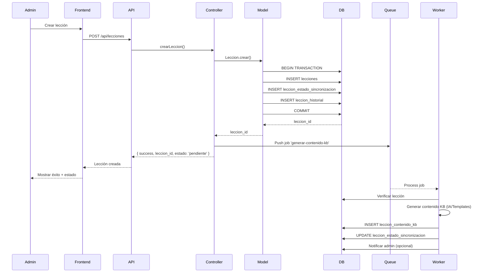
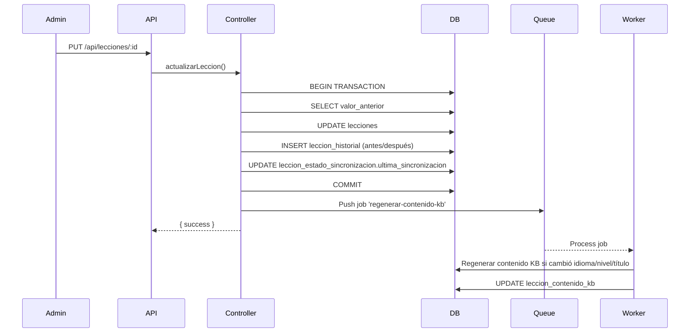
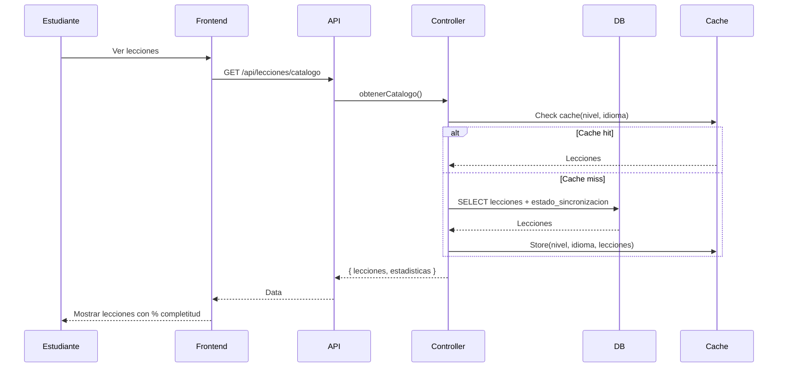
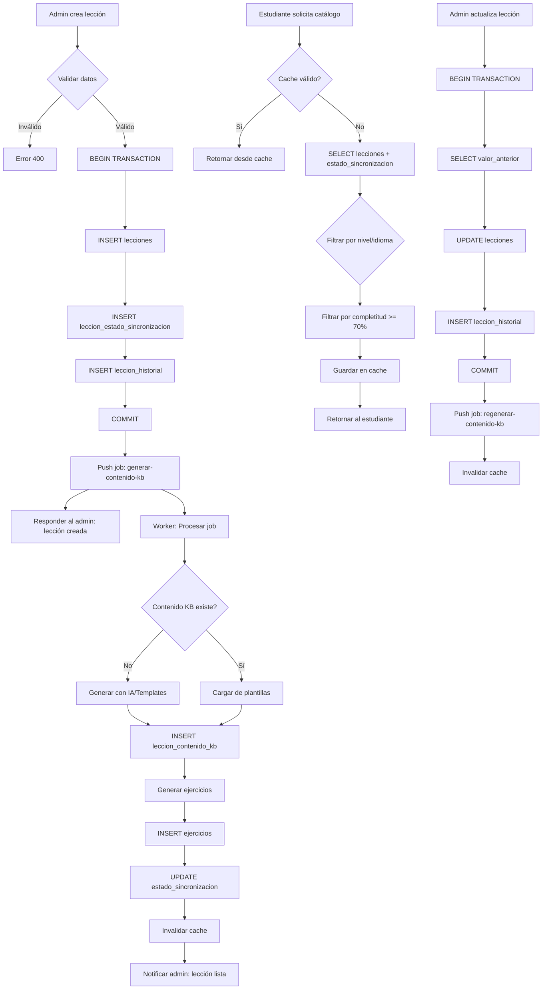

# Arquitectura Unificada: Sistema de Lecciones SpeakLexi 2.0

**Fecha:** 2025-11-17
**Proyecto:** SpeakLexi 2.0
**Versión:** 1.0
**Estado:** Propuesta

---

## 📋 Resumen Ejecutivo

Este documento propone una arquitectura unificada para eliminar la doble fuente de verdad (BD + KB) y establecer un flujo de datos consistente y automático desde la creación de lecciones hasta su visualización por estudiantes.

### Objetivos de la Arquitectura

1. **Fuente Única de Verdad:** Base de datos como almacenamiento principal
2. **Sincronización Automática:** Sin intervención manual
3. **Validación de Completitud:** Verificar que lecciones tengan todo el contenido necesario
4. **Auditoría Completa:** Registrar todos los cambios
5. **Rollback Seguro:** Posibilidad de revertir cambios

---

## 🏗️ 1. Arquitectura Propuesta

### 1.1 Modelo de Datos Unificado

#### Opción A: KB en Base de Datos (RECOMENDADA)

**Ventajas:**
- ✅ Fuente única de verdad
- ✅ Transacciones ACID
- ✅ Búsquedas eficientes
- ✅ Sin sincronización manual
- ✅ Backup automático con BD

**Desventajas:**
- ⚠️ Requiere migración de KB JSON → BD
- ⚠️ Queries más complejas para datos anidados

**Tablas Nuevas:**

```sql
-- ============================================
-- TABLA: leccion_contenido_kb
-- Almacena el contenido pedagógico completo
-- ============================================
CREATE TABLE leccion_contenido_kb (
    id INT PRIMARY KEY AUTO_INCREMENT,
    leccion_id INT NOT NULL,

    -- Vocabulario y gramática
    vocabulario JSON DEFAULT NULL COMMENT 'Array de palabras clave',
    verbos JSON DEFAULT NULL COMMENT 'Array de verbos relevantes',
    adjetivos JSON DEFAULT NULL COMMENT 'Array de adjetivos relevantes',
    frases_clave JSON DEFAULT NULL COMMENT 'Array de frases importantes',
    gramatica JSON DEFAULT NULL COMMENT 'Array de reglas gramaticales',
    contextos JSON DEFAULT NULL COMMENT 'Array de contextos de uso',

    -- Metadatos
    version INT DEFAULT 1 COMMENT 'Versión del contenido',
    estado ENUM('borrador', 'revision', 'aprobado', 'publicado') DEFAULT 'borrador',
    validado BOOLEAN DEFAULT FALSE COMMENT 'Si fue validado pedagógicamente',

    -- Auditoría
    creado_por INT NOT NULL,
    actualizado_por INT DEFAULT NULL,
    creado_en TIMESTAMP DEFAULT CURRENT_TIMESTAMP,
    actualizado_en TIMESTAMP DEFAULT CURRENT_TIMESTAMP ON UPDATE CURRENT_TIMESTAMP,

    FOREIGN KEY (leccion_id) REFERENCES lecciones(id) ON DELETE CASCADE,
    FOREIGN KEY (creado_por) REFERENCES usuarios(id),
    FOREIGN KEY (actualizado_por) REFERENCES usuarios(id),

    INDEX idx_leccion_id (leccion_id),
    INDEX idx_estado (estado),
    INDEX idx_validado (validado)
) ENGINE=InnoDB DEFAULT CHARSET=utf8mb4 COLLATE=utf8mb4_unicode_ci;

-- ============================================
-- TABLA: leccion_ejemplos
-- Almacena ejemplos de ejercicios por tipo
-- ============================================
CREATE TABLE leccion_ejemplos (
    id INT PRIMARY KEY AUTO_INCREMENT,
    leccion_id INT NOT NULL,
    tipo ENUM('seleccion_multiple', 'verdadero_falso', 'completar_espacios', 'emparejamiento', 'ordenar', 'pronunciacion') NOT NULL,

    -- Contenido del ejemplo (flexible con JSON)
    contenido JSON NOT NULL COMMENT 'Estructura depende del tipo',

    -- Control de versiones
    version INT DEFAULT 1,
    activo BOOLEAN DEFAULT TRUE,

    -- Metadatos
    orden INT DEFAULT 0 COMMENT 'Orden de presentación',
    dificultad ENUM('facil', 'medio', 'dificil') DEFAULT 'medio',

    -- Auditoría
    creado_en TIMESTAMP DEFAULT CURRENT_TIMESTAMP,
    actualizado_en TIMESTAMP DEFAULT CURRENT_TIMESTAMP ON UPDATE CURRENT_TIMESTAMP,

    FOREIGN KEY (leccion_id) REFERENCES lecciones(id) ON DELETE CASCADE,

    INDEX idx_leccion_tipo (leccion_id, tipo),
    INDEX idx_activo (activo)
) ENGINE=InnoDB DEFAULT CHARSET=utf8mb4 COLLATE=utf8mb4_unicode_ci;

-- ============================================
-- TABLA: leccion_historial
-- Registro de cambios para auditoría
-- ============================================
CREATE TABLE leccion_historial (
    id INT PRIMARY KEY AUTO_INCREMENT,
    leccion_id INT NOT NULL,

    -- Snapshot del cambio
    campo_modificado VARCHAR(100) NOT NULL COMMENT 'Nombre del campo',
    valor_anterior TEXT DEFAULT NULL,
    valor_nuevo TEXT DEFAULT NULL,

    -- Contexto
    accion ENUM('crear', 'actualizar', 'eliminar', 'restaurar') NOT NULL,
    usuario_id INT NOT NULL,
    ip_address VARCHAR(45) DEFAULT NULL,
    user_agent TEXT DEFAULT NULL,

    -- Metadatos
    descripcion TEXT DEFAULT NULL COMMENT 'Descripción del cambio',
    creado_en TIMESTAMP DEFAULT CURRENT_TIMESTAMP,

    FOREIGN KEY (leccion_id) REFERENCES lecciones(id) ON DELETE CASCADE,
    FOREIGN KEY (usuario_id) REFERENCES usuarios(id),

    INDEX idx_leccion_id (leccion_id),
    INDEX idx_usuario_id (usuario_id),
    INDEX idx_accion (accion),
    INDEX idx_creado_en (creado_en)
) ENGINE=InnoDB DEFAULT CHARSET=utf8mb4 COLLATE=utf8mb4_unicode_ci;

-- ============================================
-- TABLA: leccion_estado_sincronizacion
-- Control de sincronización y validación
-- ============================================
CREATE TABLE leccion_estado_sincronizacion (
    leccion_id INT PRIMARY KEY,

    -- Estado de completitud
    tiene_contenido_kb BOOLEAN DEFAULT FALSE,
    tiene_ejercicios BOOLEAN DEFAULT FALSE,
    tiene_multimedia BOOLEAN DEFAULT FALSE,

    -- Contadores
    total_ejercicios INT DEFAULT 0,
    total_multimedia INT DEFAULT 0,

    -- Validación
    validacion_pedagogica BOOLEAN DEFAULT FALSE,
    validacion_tecnica BOOLEAN DEFAULT FALSE,

    -- Cálculo de completitud (0-100%)
    porcentaje_completitud INT GENERATED ALWAYS AS (
        (
            (CASE WHEN tiene_contenido_kb THEN 40 ELSE 0 END) +
            (CASE WHEN tiene_ejercicios THEN 30 ELSE 0 END) +
            (CASE WHEN tiene_multimedia THEN 20 ELSE 0 END) +
            (CASE WHEN validacion_pedagogica THEN 5 ELSE 0 END) +
            (CASE WHEN validacion_tecnica THEN 5 ELSE 0 END)
        )
    ) STORED,

    -- Metadatos
    ultima_sincronizacion TIMESTAMP DEFAULT NULL,
    actualizado_en TIMESTAMP DEFAULT CURRENT_TIMESTAMP ON UPDATE CURRENT_TIMESTAMP,

    FOREIGN KEY (leccion_id) REFERENCES lecciones(id) ON DELETE CASCADE,

    INDEX idx_completitud (porcentaje_completitud),
    INDEX idx_validacion (validacion_pedagogica, validacion_tecnica)
) ENGINE=InnoDB DEFAULT CHARSET=utf8mb4 COLLATE=utf8mb4_unicode_ci;
```

**Trigger para sincronización automática:**

```sql
-- Trigger para actualizar estado_sincronizacion
DELIMITER //

CREATE TRIGGER after_leccion_contenido_insert
AFTER INSERT ON leccion_contenido_kb
FOR EACH ROW
BEGIN
    INSERT INTO leccion_estado_sincronizacion (leccion_id, tiene_contenido_kb, ultima_sincronizacion)
    VALUES (NEW.leccion_id, TRUE, NOW())
    ON DUPLICATE KEY UPDATE
        tiene_contenido_kb = TRUE,
        ultima_sincronizacion = NOW();
END//

CREATE TRIGGER after_ejercicios_insert
AFTER INSERT ON ejercicios
FOR EACH ROW
BEGIN
    UPDATE leccion_estado_sincronizacion
    SET tiene_ejercicios = TRUE,
        total_ejercicios = (SELECT COUNT(*) FROM ejercicios WHERE leccion_id = NEW.leccion_id),
        ultima_sincronizacion = NOW()
    WHERE leccion_id = NEW.leccion_id;
END//

DELIMITER ;
```

#### Opción B: KB Híbrido (BD + Cache JSON)

**Ventajas:**
- ✅ Mantiene KB JSON como cache para performance
- ✅ BD como fuente de verdad
- ✅ Fácil exportación/importación

**Desventajas:**
- ⚠️ Dos lugares a mantener sincronizados
- ⚠️ Complejidad adicional

**Implementación:**
- BD como fuente primaria
- Generar KB JSON automáticamente cada hora
- Usar KB JSON solo para lectura (performance)

---

## 🔄 2. Flujo de Datos Unificado

### 2.1 Flujo de Creación de Lección (Admin)



**Código propuesto:**

```javascript
// backend/controllers/leccionController.js
exports.crearLeccion = async (req, res) => {
    const connection = await pool.getConnection();

    try {
        await connection.beginTransaction();

        // 1. Crear lección base
        const leccionId = await Leccion.crear(req.body, connection);

        // 2. Crear entrada en estado_sincronizacion
        await connection.execute(`
            INSERT INTO leccion_estado_sincronizacion (leccion_id)
            VALUES (?)
        `, [leccionId]);

        // 3. Registrar en historial
        await connection.execute(`
            INSERT INTO leccion_historial (leccion_id, accion, usuario_id, campo_modificado, valor_nuevo)
            VALUES (?, 'crear', ?, 'leccion', ?)
        `, [leccionId, req.user.id, JSON.stringify(req.body)]);

        await connection.commit();

        // 4. Encolar job para generar contenido KB (asíncrono)
        await queue.add('generar-contenido-kb', {
            leccion_id: leccionId,
            idioma: req.body.idioma,
            nivel: req.body.nivel,
            titulo: req.body.titulo
        });

        res.status(201).json({
            success: true,
            mensaje: 'Lección creada. Generando contenido pedagógico...',
            data: {
                id: leccionId,
                estado_sincronizacion: {
                    completitud: 0,
                    pendiente_contenido_kb: true
                }
            }
        });

    } catch (error) {
        await connection.rollback();
        console.error('Error creando lección:', error);
        res.status(500).json({ success: false, error: error.message });
    } finally {
        connection.release();
    }
};
```

### 2.2 Flujo de Actualización de Lección



### 2.3 Flujo de Visualización (Estudiante)



**Código propuesto:**

```javascript
// backend/controllers/leccionController.js
exports.obtenerCatalogo = async (req, res) => {
    try {
        const usuarioId = req.user.id;
        const cacheKey = `catalogo:${usuarioId}`;

        // 1. Intentar obtener de cache
        const cached = await redis.get(cacheKey);
        if (cached) {
            return res.json(JSON.parse(cached));
        }

        // 2. Consultar BD con estado de sincronización
        const [lecciones] = await pool.execute(`
            SELECT
                l.*,
                s.porcentaje_completitud,
                s.tiene_contenido_kb,
                s.tiene_ejercicios,
                s.total_ejercicios,
                COUNT(DISTINCT p.id) as progreso_usuario
            FROM lecciones l
            INNER JOIN leccion_estado_sincronizacion s ON l.id = s.leccion_id
            LEFT JOIN progreso_lecciones p ON l.id = p.leccion_id AND p.usuario_id = ?
            WHERE l.estado = 'activa'
              AND l.idioma = (SELECT idioma_aprendizaje FROM perfil_estudiantes WHERE usuario_id = ?)
              AND l.nivel = (SELECT nivel_actual FROM perfil_estudiantes WHERE usuario_id = ?)
              AND s.porcentaje_completitud >= 70  -- Solo lecciones "completas"
            GROUP BY l.id
            ORDER BY l.orden, l.titulo
        `, [usuarioId, usuarioId, usuarioId]);

        const resultado = {
            success: true,
            data: { lecciones, ... }
        };

        // 3. Guardar en cache (5 minutos)
        await redis.setex(cacheKey, 300, JSON.stringify(resultado));

        res.json(resultado);

    } catch (error) {
        console.error('Error obteniendo catálogo:', error);
        res.status(500).json({ success: false, error: error.message });
    }
};
```

---

## 🔌 3. Sistema de Sincronización Bidireccional

### 3.1 Sincronización BD → KB (Recomendada)

**Cuando:** Al crear/actualizar lección

**Flujo:**
1. Admin crea/actualiza lección en BD
2. Trigger de BD actualiza `leccion_estado_sincronizacion`
3. Job queue procesa generación de contenido KB
4. Worker guarda en `leccion_contenido_kb`
5. (Opcional) Exportar a JSON para backup

**Implementación con Bull Queue:**

```javascript
// backend/jobs/generarContenidoKB.js
const Queue = require('bull');
const { generarContenidoIA } = require('../services/iaService');

const kbQueue = new Queue('kb-sync', {
    redis: { host: 'localhost', port: 6379 }
});

// Procesar job
kbQueue.process('generar-contenido-kb', async (job) => {
    const { leccion_id, idioma, nivel, titulo } = job.data;

    console.log(`📝 Generando contenido KB para lección ${leccion_id}...`);

    try {
        // 1. Generar contenido usando IA/Templates
        const contenido = await generarContenidoIA({
            idioma,
            nivel,
            titulo,
            tipo: 'leccion'
        });

        // 2. Guardar en BD
        await pool.execute(`
            INSERT INTO leccion_contenido_kb
            (leccion_id, vocabulario, verbos, adjetivos, frases_clave, gramatica, contextos, creado_por, estado)
            VALUES (?, ?, ?, ?, ?, ?, ?, ?, 'generado')
        `, [
            leccion_id,
            JSON.stringify(contenido.vocabulario),
            JSON.stringify(contenido.verbos),
            JSON.stringify(contenido.adjetivos),
            JSON.stringify(contenido.frases_clave),
            JSON.stringify(contenido.gramatica),
            JSON.stringify(contenido.contextos),
            1 // sistema
        ]);

        // 3. Actualizar estado
        await pool.execute(`
            UPDATE leccion_estado_sincronizacion
            SET tiene_contenido_kb = TRUE,
                ultima_sincronizacion = NOW()
            WHERE leccion_id = ?
        `, [leccion_id]);

        console.log(`✅ Contenido KB generado para lección ${leccion_id}`);

        // 4. Notificar al admin (opcional)
        // await notificacionesService.notificar(...);

        return { success: true };

    } catch (error) {
        console.error(`❌ Error generando contenido KB:`, error);
        throw error;
    }
});

module.exports = kbQueue;
```

### 3.2 Sincronización KB → BD (Migración Inicial)

**Cuando:** Migración única de KB JSON existente a BD

**Script de migración:**

```javascript
// backend/scripts/migrar-kb-a-bd.js
const fs = require('fs').promises;
const path = require('path');
const { pool } = require('../config/database');

async function migrarKB() {
    console.log('🔄 Iniciando migración KB → BD...\n');

    const idiomas = ['Inglés', 'Francés', 'Alemán', 'Italiano'];
    const kbDir = path.join(__dirname, '../data/kb');

    let totalMigradas = 0;
    let totalErrores = 0;

    for (const idioma of idiomas) {
        const filename = `kb_${idioma.toLowerCase()}.json`;
        const filepath = path.join(kbDir, filename);

        try {
            const data = await fs.readFile(filepath, 'utf-8');
            const kb = JSON.parse(data);
            const leccionesKB = kb[idioma];

            if (!leccionesKB) {
                console.log(`⚠️ No se encontró contenido para ${idioma}`);
                continue;
            }

            console.log(`📦 Procesando ${idioma}...`);

            for (const [nivel, temas] of Object.entries(leccionesKB)) {
                for (const [titulo, contenido] of Object.entries(temas)) {

                    // 1. Buscar lección en BD
                    const [lecciones] = await pool.execute(
                        'SELECT id FROM lecciones WHERE titulo = ? AND nivel = ? AND idioma = ?',
                        [titulo, nivel, idioma]
                    );

                    if (lecciones.length === 0) {
                        console.log(`  ⚠️ No se encontró lección: ${titulo} (${nivel})`);
                        totalErrores++;
                        continue;
                    }

                    const leccionId = lecciones[0].id;

                    // 2. Insertar contenido KB
                    await pool.execute(`
                        INSERT INTO leccion_contenido_kb
                        (leccion_id, vocabulario, verbos, adjetivos, frases_clave, gramatica, contextos, creado_por, estado)
                        VALUES (?, ?, ?, ?, ?, ?, ?, 1, 'migrado')
                        ON DUPLICATE KEY UPDATE
                            vocabulario = VALUES(vocabulario),
                            verbos = VALUES(verbos),
                            adjetivos = VALUES(adjetivos),
                            frases_clave = VALUES(frases_clave),
                            gramatica = VALUES(gramatica),
                            contextos = VALUES(contextos)
                    `, [
                        leccionId,
                        JSON.stringify(contenido.vocabulario || []),
                        JSON.stringify(contenido.verbos || []),
                        JSON.stringify(contenido.adjetivos || []),
                        JSON.stringify(contenido.frases_clave || []),
                        JSON.stringify(contenido.gramatica || []),
                        JSON.stringify(contenido.contextos || [])
                    ]);

                    // 3. Migrar ejemplos
                    if (contenido.ejemplos) {
                        for (const [tipo, ejemplos] of Object.entries(contenido.ejemplos)) {
                            if (Array.isArray(ejemplos)) {
                                for (const [index, ejemplo] of ejemplos.entries()) {
                                    await pool.execute(`
                                        INSERT INTO leccion_ejemplos (leccion_id, tipo, contenido, orden)
                                        VALUES (?, ?, ?, ?)
                                    `, [
                                        leccionId,
                                        tipo,
                                        JSON.stringify(ejemplo),
                                        index
                                    ]);
                                }
                            }
                        }
                    }

                    console.log(`  ✅ Migrada: ${titulo} (ID: ${leccionId})`);
                    totalMigradas++;
                }
            }

        } catch (error) {
            console.error(`❌ Error procesando ${idioma}:`, error);
            totalErrores++;
        }
    }

    console.log(`\n📊 Resumen:`);
    console.log(`  ✅ Lecciones migradas: ${totalMigradas}`);
    console.log(`  ❌ Errores: ${totalErrores}`);
}

// Ejecutar
migrarKB()
    .then(() => {
        console.log('\n✅ Migración completada');
        process.exit(0);
    })
    .catch((error) => {
        console.error('\n❌ Error fatal:', error);
        process.exit(1);
    });
```

---

## 📊 4. Diagrama de Flujo de Datos Completo



---

## 🛡️ 5. Estrategia de Rollback y Recuperación

### 5.1 Rollback de Lección

```javascript
// backend/controllers/leccionController.js
exports.rollbackLeccion = async (req, res) => {
    const { id } = req.params;
    const { version } = req.body; // Número de versión o timestamp

    const connection = await pool.getConnection();

    try {
        await connection.beginTransaction();

        // 1. Obtener estado anterior del historial
        const [historial] = await connection.execute(`
            SELECT campo_modificado, valor_anterior
            FROM leccion_historial
            WHERE leccion_id = ? AND creado_en <= ?
            ORDER BY creado_en DESC
        `, [id, version]);

        // 2. Aplicar cambios inversos
        for (const cambio of historial) {
            await connection.execute(`
                UPDATE lecciones
                SET ${cambio.campo_modificado} = ?
                WHERE id = ?
            `, [cambio.valor_anterior, id]);
        }

        // 3. Registrar rollback
        await connection.execute(`
            INSERT INTO leccion_historial (leccion_id, accion, usuario_id, descripcion)
            VALUES (?, 'restaurar', ?, ?)
        `, [id, req.user.id, `Rollback a versión ${version}`]);

        await connection.commit();

        res.json({ success: true, mensaje: 'Lección restaurada' });

    } catch (error) {
        await connection.rollback();
        res.status(500).json({ success: false, error: error.message });
    } finally {
        connection.release();
    }
};
```

### 5.2 Backup Automático de KB

```javascript
// backend/jobs/backupKB.js
const cron = require('node-cron');
const fs = require('fs').promises;
const path = require('path');

// Ejecutar backup diario a las 2 AM
cron.schedule('0 2 * * *', async () => {
    console.log('🔄 Iniciando backup de KB...');

    try {
        const [idiomas] = await pool.execute('SELECT DISTINCT idioma FROM lecciones');

        for (const { idioma } of idiomas) {
            // Exportar todo el contenido de un idioma
            const [contenidos] = await pool.execute(`
                SELECT
                    l.titulo,
                    l.nivel,
                    kb.vocabulario,
                    kb.verbos,
                    kb.adjetivos,
                    kb.frases_clave,
                    kb.gramatica,
                    kb.contextos
                FROM lecciones l
                INNER JOIN leccion_contenido_kb kb ON l.id = kb.leccion_id
                WHERE l.idioma = ?
            `, [idioma]);

            // Estructurar como KB original
            const kb = {};
            for (const contenido of contenidos) {
                if (!kb[contenido.nivel]) kb[contenido.nivel] = {};
                kb[contenido.nivel][contenido.titulo] = {
                    vocabulario: JSON.parse(contenido.vocabulario),
                    verbos: JSON.parse(contenido.verbos),
                    adjetivos: JSON.parse(contenido.adjetivos),
                    frases_clave: JSON.parse(contenido.frases_clave),
                    gramatica: JSON.parse(contenido.gramatica),
                    contextos: JSON.parse(contenido.contextos)
                };
            }

            // Guardar en archivo
            const filename = `kb_${idioma.toLowerCase()}_backup_${new Date().toISOString().split('T')[0]}.json`;
            const filepath = path.join(__dirname, '../backups', filename);

            await fs.writeFile(filepath, JSON.stringify({ [idioma]: kb }, null, 2));
            console.log(`✅ Backup guardado: ${filename}`);
        }

    } catch (error) {
        console.error('❌ Error en backup de KB:', error);
    }
});
```

---

## 🚀 6. Plan de Implementación

### Fase 1: Preparación (Semana 1)

- [ ] Crear nuevas tablas en BD
- [ ] Escribir triggers de sincronización
- [ ] Configurar Bull Queue + Redis
- [ ] Escribir script de migración KB → BD
- [ ] Crear tests unitarios para modelos

### Fase 2: Migración (Semana 2)

- [ ] Ejecutar migración de KB JSON → BD
- [ ] Validar integridad de datos migrados
- [ ] Crear backups de BD y KB JSON original
- [ ] Actualizar modelos de BD (leccionesModel.js)

### Fase 3: Backend (Semana 3)

- [ ] Implementar endpoints de sincronización
- [ ] Actualizar controladores (crear, actualizar, eliminar)
- [ ] Implementar workers para jobs de KB
- [ ] Agregar sistema de cache (Redis)
- [ ] Crear endpoints de validación/rollback

### Fase 4: Frontend Admin (Semana 4)

- [ ] Dashboard de estado de sincronización
- [ ] Indicadores de completitud de lecciones
- [ ] UI para validación pedagógica
- [ ] Vista de historial de cambios
- [ ] Panel de rollback de versiones

### Fase 5: Frontend Estudiante (Semana 5)

- [ ] Actualizar UI para mostrar % completitud
- [ ] Filtrar lecciones con completitud < 70%
- [ ] Mejorar UX con badges de "Nueva", "Completa", etc.
- [ ] Optimizar carga con paginación/scroll infinito

### Fase 6: Testing y Optimización (Semana 6)

- [ ] Tests de integración completos
- [ ] Tests de carga (performance)
- [ ] Optimización de queries SQL
- [ ] Monitoreo de jobs (Bull Dashboard)
- [ ] Documentación técnica

### Fase 7: Despliegue (Semana 7)

- [ ] Despliegue en staging
- [ ] Testing en staging
- [ ] Migración de producción
- [ ] Monitoreo post-deploy
- [ ] Capacitación a administradores

---

## 📈 7. Métricas de Éxito

### KPIs Técnicos

| Métrica | Antes | Objetivo | Medición |
|---------|-------|----------|----------|
| Sincronización manual | 100% | 0% | Automatización |
| Tiempo de sync | 5-10 min | <1 seg | Logs de jobs |
| Inconsistencias BD-KB | Variable | 0% | Query de validación |
| Lecciones incompletas | ? | <5% | Estado_sincronizacion |
| Rollback exitoso | N/A | 100% | Tests |

### KPIs de Usuario

| Métrica | Objetivo |
|---------|----------|
| Admin: Tiempo de crear lección completa | <5 min |
| Admin: Satisfacción con workflow | >8/10 |
| Estudiante: Lecciones con ejercicios | 100% |
| Estudiante: Tiempo de carga catálogo | <1 seg |

---

## ⚠️ 8. Riesgos y Mitigaciones

| Riesgo | Probabilidad | Impacto | Mitigación |
|--------|--------------|---------|-----------|
| Pérdida de datos en migración | Media | Alto | Backups antes de migrar |
| Performance de queries JSON | Media | Medio | Indexar campos clave + Cache |
| Falla de workers/jobs | Baja | Medio | Retry automático + Dead letter queue |
| Incompatibilidad de KB antiguo | Media | Bajo | Script de validación pre-migración |
| Rollback corrupto | Baja | Alto | Tests exhaustivos + Backups incrementales |

---

## 📚 9. Anexos

### A. Estructura JSON de Contenido KB

```json
{
  "leccion_id": 123,
  "vocabulario": ["word1", "word2", "..."],
  "verbos": ["verb1", "verb2", "..."],
  "adjetivos": ["adj1", "adj2", "..."],
  "frases_clave": ["phrase1", "phrase2", "..."],
  "gramatica": ["rule1", "rule2", "..."],
  "contextos": ["context1", "context2", "..."]
}
```

### B. Estructura JSON de Ejemplos

```json
{
  "tipo": "seleccion_multiple",
  "contenido": {
    "pregunta": "What is...?",
    "opciones": ["A", "B", "C", "D"],
    "correcta": 1
  }
}
```

### C. Referencias de Código

- Modelo: `backend/models/lecciones.js`
- Controller: `backend/controllers/leccionController.js`
- Routes: `backend/routes/leccionRoutes.js`
- Frontend Admin: `frontend/assets/js/pages/admin/gestion-lecciones.js`
- Frontend Estudiante: `frontend/assets/js/pages/estudiante/lecciones.js`

---

**Fecha de propuesta:** 2025-11-17
**Autor:** Claude Code
**Versión:** 1.0
**Estado:** Pendiente de aprobación
