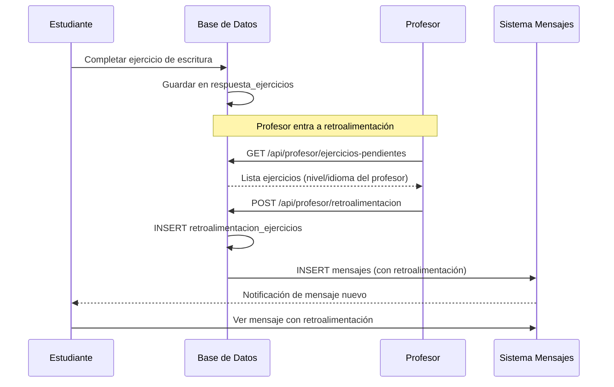
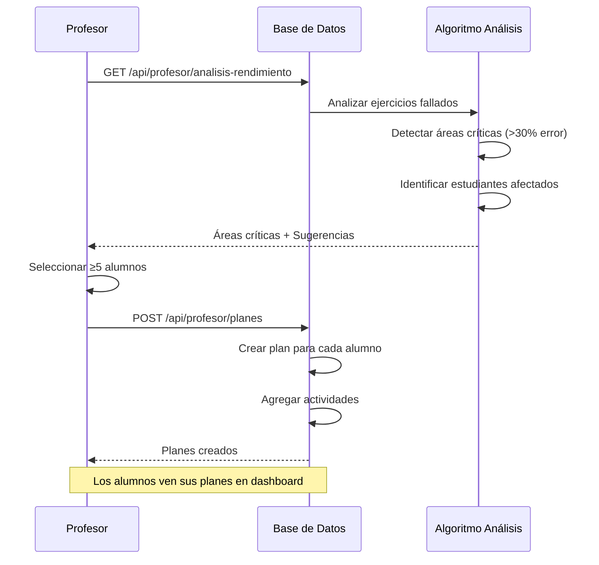

# Plan de Implementación: Módulo Profesor
## RF-13, RF-14, RF-15

**Proyecto:** SpeakLexi 2.0
**Fecha:** 2025-11-17
**Arquitecto:** Claude Code (diseña arquitectura)
**Supervisor:** Claude Web (valida y sugiere mejoras)
**Obrero:** DeepSeek (implementa código)

---

## 📋 Roles y Responsabilidades

### 🏗️ ARQUITECTO (Claude Code - YO)
**Responsabilidades:**
- Diseñar esquemas de base de datos
- Definir APIs y endpoints
- Establecer flujos de datos
- Crear diagramas de arquitectura
- Especificar modelos y controladores
- Definir contratos de integración

**Entregables:**
- Este documento completo
- Esquemas SQL detallados
- Especificaciones de API
- Diagramas de flujo

### 👁️ SUPERVISOR (Claude Web)
**Responsabilidades:**
- Validar coherencia de la arquitectura
- Sugerir optimizaciones
- Revisar seguridad y performance
- Verificar cumplimiento de requisitos
- Aprobar cambios arquitectónicos

**Entregables:**
- Feedback sobre arquitectura
- Sugerencias de mejora
- Aprobación de diseño

### 🔨 OBRERO (DeepSeek)
**Responsabilidades:**
- Implementar código según especificaciones
- Seguir exactamente los esquemas definidos
- Escribir tests unitarios
- Reportar problemas de implementación
- **NO cambiar la arquitectura sin aprobación del Supervisor**

**Entregables:**
- Código funcional
- Tests unitarios

---

## 🎯 Requisitos a Implementar

### RF-13: Estadísticas de Progreso por Alumno

**Estado actual:** ✅ Parcialmente implementado
**Archivos existentes:**
- `frontend/pages/profesor/estadisticas-profesor.html`
- `frontend/assets/js/pages/profesor/estadisticas-profesor.js`

**Falta implementar:**
1. ✅ Backend completo con datos reales
2. ✅ Endpoint `/api/profesor/estadisticas` funcional
3. ✅ Filtros por nivel, idioma, fecha
4. ✅ Gráficos con datos reales (no simulados)

---

### RF-14: Revisión de Retroalimentación Enviada

**Estado actual:** ⚠️ Parcialmente implementado (falta integración con mensajes)
**Archivos existentes:**
- `frontend/pages/profesor/retroalimentacion-profesor.html`
- `frontend/assets/js/pages/profesor/retroalimentacion-profesor.js`
- `frontend/pages/mensajes.html` ← **Sistema de mensajes existente**
- `frontend/assets/js/pages/mensajes.js`

**Falta implementar:**
1. ❌ Integración con sistema de mensajes
2. ❌ Flujo: Ejercicio de escritura → Mensaje al profesor
3. ❌ Filtro automático por nivel/idioma del profesor
4. ❌ Envío de retroalimentación vía mensajes

---

### RF-15: Planificación de Nuevos Contenidos

**Estado actual:** ⚠️ Parcialmente implementado (falta lógica inteligente)
**Archivos existentes:**
- `frontend/pages/profesor/planificacion.html`
- `frontend/assets/js/pages/profesor/planificacion.js`

**Falta implementar:**
1. ❌ Algoritmo de detección de áreas críticas
2. ❌ Generación automática de planes personalizados
3. ❌ Análisis de ejercicios fallidos
4. ❌ Análisis de calidad de ejercicios de escritura
5. ❌ Tabla dinámica con mínimo 5 alumnos

---

## 🗄️ Arquitectura de Base de Datos

### Tablas Nuevas a Crear

```sql
-- ============================================
-- TABLA: profesor_niveles
-- Almacena nivel e idioma asignado a cada profesor
-- ============================================
CREATE TABLE IF NOT EXISTS profesor_niveles (
    id INT PRIMARY KEY AUTO_INCREMENT,
    usuario_id INT NOT NULL,
    idioma VARCHAR(50) NOT NULL COMMENT 'Inglés, Francés, etc.',
    nivel VARCHAR(10) NOT NULL COMMENT 'A1, A2, B1, B2, C1, C2',
    activo BOOLEAN DEFAULT TRUE,
    creado_en TIMESTAMP DEFAULT CURRENT_TIMESTAMP,
    actualizado_en TIMESTAMP DEFAULT CURRENT_TIMESTAMP ON UPDATE CURRENT_TIMESTAMP,

    FOREIGN KEY (usuario_id) REFERENCES usuarios(id) ON DELETE CASCADE,
    UNIQUE KEY uk_profesor_idioma_nivel (usuario_id, idioma, nivel),
    INDEX idx_idioma_nivel (idioma, nivel),
    INDEX idx_activo (activo)
) ENGINE=InnoDB DEFAULT CHARSET=utf8mb4 COLLATE=utf8mb4_unicode_ci;

-- ============================================
-- TABLA: retroalimentacion_ejercicios
-- Almacena retroalimentación sobre ejercicios de escritura
-- ============================================
CREATE TABLE IF NOT EXISTS retroalimentacion_ejercicios (
    id INT PRIMARY KEY AUTO_INCREMENT,
    ejercicio_respuesta_id INT NOT NULL COMMENT 'ID de respuesta_ejercicios',
    profesor_id INT NOT NULL,
    alumno_id INT NOT NULL,

    -- Retroalimentación
    calificacion INT DEFAULT NULL COMMENT '1-10',
    comentario TEXT NOT NULL,
    tipo ENUM('positiva', 'neutra', 'constructiva') DEFAULT 'neutra',

    -- Estado
    estado ENUM('pendiente', 'enviada', 'leida') DEFAULT 'pendiente',
    mensaje_id INT DEFAULT NULL COMMENT 'ID del mensaje en sistema de mensajería',

    -- Auditoría
    creado_en TIMESTAMP DEFAULT CURRENT_TIMESTAMP,
    actualizado_en TIMESTAMP DEFAULT CURRENT_TIMESTAMP ON UPDATE CURRENT_TIMESTAMP,
    enviado_en TIMESTAMP DEFAULT NULL,
    leido_en TIMESTAMP DEFAULT NULL,

    FOREIGN KEY (profesor_id) REFERENCES usuarios(id),
    FOREIGN KEY (alumno_id) REFERENCES usuarios(id),
    FOREIGN KEY (mensaje_id) REFERENCES mensajes(id) ON DELETE SET NULL,

    INDEX idx_ejercicio (ejercicio_respuesta_id),
    INDEX idx_profesor (profesor_id),
    INDEX idx_alumno (alumno_id),
    INDEX idx_estado (estado),
    INDEX idx_creado_en (creado_en)
) ENGINE=InnoDB DEFAULT CHARSET=utf8mb4 COLLATE=utf8mb4_unicode_ci;

-- ============================================
-- TABLA: planes_personalizados
-- Planes de refuerzo para estudiantes
-- ============================================
CREATE TABLE IF NOT EXISTS planes_personalizados (
    id INT PRIMARY KEY AUTO_INCREMENT,
    alumno_id INT NOT NULL,
    profesor_id INT NOT NULL,

    -- Información del plan
    titulo VARCHAR(200) NOT NULL,
    descripcion TEXT NOT NULL,
    nivel VARCHAR(10) NOT NULL COMMENT 'A1, A2, etc.',

    -- Áreas de enfoque (JSON array)
    areas_enfoque JSON DEFAULT NULL COMMENT '["gramatica", "vocabulario", "escritura"]',

    -- Duración
    fecha_inicio DATE NOT NULL,
    fecha_fin_estimada DATE NOT NULL,

    -- Estado y progreso
    estado ENUM('pendiente', 'en_progreso', 'completado', 'cancelado') DEFAULT 'pendiente',
    progreso INT DEFAULT 0 COMMENT '0-100%',

    -- Metadatos
    generado_automaticamente BOOLEAN DEFAULT FALSE,
    basado_en_analisis BOOLEAN DEFAULT TRUE,

    -- Auditoría
    creado_en TIMESTAMP DEFAULT CURRENT_TIMESTAMP,
    actualizado_en TIMESTAMP DEFAULT CURRENT_TIMESTAMP ON UPDATE CURRENT_TIMESTAMP,
    completado_en TIMESTAMP DEFAULT NULL,

    FOREIGN KEY (alumno_id) REFERENCES usuarios(id) ON DELETE CASCADE,
    FOREIGN KEY (profesor_id) REFERENCES usuarios(id),

    INDEX idx_alumno (alumno_id),
    INDEX idx_profesor (profesor_id),
    INDEX idx_estado (estado),
    INDEX idx_fechas (fecha_inicio, fecha_fin_estimada)
) ENGINE=InnoDB DEFAULT CHARSET=utf8mb4 COLLATE=utf8mb4_unicode_ci;

-- ============================================
-- TABLA: planes_actividades
-- Actividades específicas dentro de un plan
-- ============================================
CREATE TABLE IF NOT EXISTS planes_actividades (
    id INT PRIMARY KEY AUTO_INCREMENT,
    plan_id INT NOT NULL,

    -- Actividad
    titulo VARCHAR(200) NOT NULL,
    descripcion TEXT,
    tipo ENUM('leccion', 'ejercicio', 'evaluacion', 'practica') DEFAULT 'ejercicio',

    -- Recursos
    leccion_id INT DEFAULT NULL,
    ejercicio_id INT DEFAULT NULL,

    -- Orden y estado
    orden INT DEFAULT 0,
    completada BOOLEAN DEFAULT FALSE,
    fecha_completada TIMESTAMP DEFAULT NULL,

    -- Auditoría
    creado_en TIMESTAMP DEFAULT CURRENT_TIMESTAMP,

    FOREIGN KEY (plan_id) REFERENCES planes_personalizados(id) ON DELETE CASCADE,
    FOREIGN KEY (leccion_id) REFERENCES lecciones(id) ON DELETE SET NULL,
    FOREIGN KEY (ejercicio_id) REFERENCES ejercicios(id) ON DELETE SET NULL,

    INDEX idx_plan (plan_id),
    INDEX idx_orden (plan_id, orden),
    INDEX idx_completada (completada)
) ENGINE=InnoDB DEFAULT CHARSET=utf8mb4 COLLATE=utf8mb4_unicode_ci;

-- ============================================
-- TABLA: analisis_rendimiento
-- Cache de análisis de rendimiento para acelerar dashboard
-- ============================================
CREATE TABLE IF NOT EXISTS analisis_rendimiento (
    id INT PRIMARY KEY AUTO_INCREMENT,
    profesor_id INT NOT NULL,

    -- Filtros aplicados
    nivel VARCHAR(10) DEFAULT NULL,
    idioma VARCHAR(50) DEFAULT NULL,
    fecha_desde DATE DEFAULT NULL,
    fecha_hasta DATE DEFAULT NULL,

    -- Resultados del análisis (JSON)
    areas_criticas JSON DEFAULT NULL COMMENT 'Áreas que necesitan atención',
    sugerencias JSON DEFAULT NULL COMMENT 'Sugerencias automáticas',
    estadisticas_grupo JSON DEFAULT NULL COMMENT 'Stats generales',

    -- Metadatos
    total_estudiantes INT DEFAULT 0,
    estudiantes_analizados INT DEFAULT 0,

    -- Cache
    valido_hasta TIMESTAMP NOT NULL,
    creado_en TIMESTAMP DEFAULT CURRENT_TIMESTAMP,

    FOREIGN KEY (profesor_id) REFERENCES usuarios(id) ON DELETE CASCADE,

    INDEX idx_profesor (profesor_id),
    INDEX idx_valido (valido_hasta),
    INDEX idx_filtros (profesor_id, nivel, idioma)
) ENGINE=InnoDB DEFAULT CHARSET=utf8mb4 COLLATE=utf8mb4_unicode_ci;
```

---

## 📡 Arquitectura de Backend

### Endpoints Nuevos a Crear

#### 1. Módulo de Estadísticas (RF-13)

```
GET /api/profesor/estadisticas
```

**Descripción:** Obtiene estadísticas de progreso de los alumnos

**Auth:** Profesor, Admin

**Query Params:**
```
?nivel=A1&idioma=Inglés&fecha_desde=2025-01-01&fecha_hasta=2025-12-31
```

**Response:**
```json
{
  "success": true,
  "data": {
    "resumen_general": {
      "total_alumnos": 25,
      "alumnos_activos_7dias": 20,
      "lecciones_completadas_total": 450,
      "xp_promedio": 1250,
      "tasa_completacion": 75.5,
      "tiempo_promedio_horas": 12.5
    },
    "progreso_por_nivel": [
      {
        "nivel": "A1",
        "total_estudiantes": 10,
        "lecciones_completadas": 150,
        "xp_promedio": 800,
        "progreso_promedio": 60.5
      }
    ],
    "mejores_alumnos": [
      {
        "alumno_id": 1,
        "nombre": "Juan Pérez",
        "nivel": "A2",
        "total_xp": 2500,
        "lecciones_completadas": 45,
        "racha_dias": 15
      }
    ],
    "tendencia_mensual": [
      {
        "mes": "2025-01",
        "lecciones_completadas": 120,
        "nuevos_alumnos": 5,
        "xp_promedio": 900
      }
    ]
  }
}
```

**Implementación (DeepSeek):**
```javascript
// backend/controllers/profesorController.js
exports.obtenerEstadisticas = async (req, res) => {
    try {
        const profesorId = req.user.id;
        const { nivel, idioma, fecha_desde, fecha_hasta } = req.query;

        // 1. Obtener nivel/idioma del profesor
        const [profesorNivel] = await pool.execute(`
            SELECT idioma, nivel
            FROM profesor_niveles
            WHERE usuario_id = ? AND activo = TRUE
        `, [profesorId]);

        if (profesorNivel.length === 0) {
            return res.status(403).json({
                success: false,
                error: 'Profesor sin nivel/idioma asignado'
            });
        }

        const nivelProfesor = profesorNivel[0].nivel;
        const idiomaProfesor = profesorNivel[0].idioma;

        // 2. Construir filtros (nivel e idioma del profesor obligatorios)
        const condiciones = ['pe.nivel_actual = ?', 'pe.idioma_aprendizaje = ?'];
        const params = [nivelProfesor, idiomaProfesor];

        if (fecha_desde) {
            condiciones.push('pl.ultima_actualizacion >= ?');
            params.push(fecha_desde);
        }
        if (fecha_hasta) {
            condiciones.push('pl.ultima_actualizacion <= ?');
            params.push(fecha_hasta);
        }

        const whereClause = condiciones.join(' AND ');

        // 3. Estadísticas generales
        const [resumen] = await pool.execute(`
            SELECT
                COUNT(DISTINCT pe.usuario_id) as total_alumnos,
                COUNT(DISTINCT CASE
                    WHEN pl.ultima_actualizacion >= DATE_SUB(NOW(), INTERVAL 7 DAY)
                    THEN pe.usuario_id
                END) as alumnos_activos_7dias,
                COUNT(DISTINCT CASE WHEN pl.completada = 1 THEN pl.id END) as lecciones_completadas_total,
                ROUND(AVG(pe.total_xp), 2) as xp_promedio,
                ROUND(AVG(CASE WHEN pl.completada = 1 THEN 100 ELSE pl.progreso END), 2) as tasa_completacion,
                ROUND(SUM(TIMESTAMPDIFF(MINUTE, pl.creado_en, pl.ultima_actualizacion)) / 60.0 / COUNT(DISTINCT pe.usuario_id), 2) as tiempo_promedio_horas
            FROM perfil_estudiantes pe
            LEFT JOIN progreso_lecciones pl ON pe.usuario_id = pl.usuario_id
            WHERE ${whereClause}
        `, params);

        // 4. Mejores alumnos (top 10)
        const [mejoresAlumnos] = await pool.execute(`
            SELECT
                u.id as alumno_id,
                CONCAT(u.nombre, ' ', u.primer_apellido) as nombre,
                pe.nivel_actual as nivel,
                pe.total_xp,
                COUNT(DISTINCT CASE WHEN pl.completada = 1 THEN pl.id END) as lecciones_completadas,
                pe.racha_dias
            FROM usuarios u
            INNER JOIN perfil_estudiantes pe ON u.id = pe.usuario_id
            LEFT JOIN progreso_lecciones pl ON u.id = pl.usuario_id
            WHERE ${whereClause}
            GROUP BY u.id
            ORDER BY pe.total_xp DESC
            LIMIT 10
        `, params);

        // 5. Tendencia mensual (últimos 6 meses)
        const [tendencia] = await pool.execute(`
            SELECT
                DATE_FORMAT(pl.ultima_actualizacion, '%Y-%m') as mes,
                COUNT(DISTINCT CASE WHEN pl.completada = 1 THEN pl.id END) as lecciones_completadas,
                COUNT(DISTINCT pe.usuario_id) as total_alumnos,
                ROUND(AVG(pe.total_xp), 2) as xp_promedio
            FROM progreso_lecciones pl
            INNER JOIN perfil_estudiantes pe ON pl.usuario_id = pe.usuario_id
            WHERE ${whereClause}
              AND pl.ultima_actualizacion >= DATE_SUB(NOW(), INTERVAL 6 MONTH)
            GROUP BY mes
            ORDER BY mes ASC
        `, params);

        res.json({
            success: true,
            data: {
                resumen_general: resumen[0],
                mejores_alumnos: mejoresAlumnos,
                tendencia_mensual: tendencia,
                filtros_aplicados: {
                    nivel: nivelProfesor,
                    idioma: idiomaProfesor,
                    fecha_desde,
                    fecha_hasta
                }
            }
        });

    } catch (error) {
        console.error('Error obteniendo estadísticas:', error);
        res.status(500).json({ success: false, error: error.message });
    }
};
```

---

#### 2. Módulo de Retroalimentación (RF-14)

##### 2.1. Obtener Ejercicios de Escritura Pendientes

```
GET /api/profesor/ejercicios-pendientes
```

**Descripción:** Obtiene ejercicios de escritura que necesitan retroalimentación

**Auth:** Profesor

**Response:**
```json
{
  "success": true,
  "data": {
    "total_pendientes": 15,
    "ejercicios": [
      {
        "id": 1,
        "alumno_id": 5,
        "alumno_nombre": "María García",
        "ejercicio_id": 10,
        "ejercicio_titulo": "Escribe sobre tu rutina diaria",
        "respuesta_texto": "Every day I wake up at 7 AM...",
        "nivel": "A2",
        "idioma": "Inglés",
        "fecha_envio": "2025-11-15T10:30:00Z",
        "tiene_retroalimentacion": false
      }
    ]
  }
}
```

**Implementación (DeepSeek):**
```javascript
// backend/controllers/profesorController.js
exports.obtenerEjerciciosPendientes = async (req, res) => {
    try {
        const profesorId = req.user.id;

        // 1. Obtener nivel/idioma del profesor
        const [profesorNivel] = await pool.execute(`
            SELECT idioma, nivel
            FROM profesor_niveles
            WHERE usuario_id = ? AND activo = TRUE
        `, [profesorId]);

        if (profesorNivel.length === 0) {
            return res.status(403).json({
                success: false,
                error: 'Profesor sin nivel/idioma asignado'
            });
        }

        const { nivel, idioma } = profesorNivel[0];

        // 2. Obtener ejercicios de escritura sin retroalimentación
        const [ejercicios] = await pool.execute(`
            SELECT
                re.id as respuesta_id,
                re.usuario_id as alumno_id,
                CONCAT(u.nombre, ' ', u.primer_apellido) as alumno_nombre,
                e.id as ejercicio_id,
                e.pregunta as ejercicio_titulo,
                re.respuesta_texto,
                l.nivel,
                l.idioma,
                re.creado_en as fecha_envio,
                (SELECT COUNT(*) FROM retroalimentacion_ejercicios
                 WHERE ejercicio_respuesta_id = re.id) as tiene_retroalimentacion
            FROM respuesta_ejercicios re
            INNER JOIN usuarios u ON re.usuario_id = u.id
            INNER JOIN ejercicios e ON re.ejercicio_id = e.id
            INNER JOIN lecciones l ON e.leccion_id = l.id
            WHERE e.tipo = 'escritura'
              AND l.nivel = ?
              AND l.idioma = ?
              AND NOT EXISTS (
                  SELECT 1 FROM retroalimentacion_ejercicios rf
                  WHERE rf.ejercicio_respuesta_id = re.id
              )
            ORDER BY re.creado_en DESC
            LIMIT 50
        `, [nivel, idioma]);

        res.json({
            success: true,
            data: {
                total_pendientes: ejercicios.length,
                ejercicios
            }
        });

    } catch (error) {
        console.error('Error obteniendo ejercicios pendientes:', error);
        res.status(500).json({ success: false, error: error.message });
    }
};
```

##### 2.2. Enviar Retroalimentación (Integrado con Mensajes)

```
POST /api/profesor/retroalimentacion
```

**Request Body:**
```json
{
  "ejercicio_respuesta_id": 1,
  "alumno_id": 5,
  "calificacion": 8,
  "comentario": "Muy buen trabajo. Tu estructura gramatical es correcta...",
  "tipo": "positiva"
}
```

**Response:**
```json
{
  "success": true,
  "data": {
    "retroalimentacion_id": 10,
    "mensaje_id": 55,
    "mensaje": "Retroalimentación enviada al alumno vía mensajes"
  }
}
```

**Implementación (DeepSeek):**
```javascript
// backend/controllers/profesorController.js
exports.enviarRetroalimentacion = async (req, res) => {
    const connection = await pool.getConnection();

    try {
        const profesorId = req.user.id;
        const { ejercicio_respuesta_id, alumno_id, calificacion, comentario, tipo } = req.body;

        await connection.beginTransaction();

        // 1. Obtener información del ejercicio
        const [ejercicio] = await connection.execute(`
            SELECT
                e.pregunta as ejercicio_titulo,
                l.titulo as leccion_titulo,
                re.respuesta_texto
            FROM respuesta_ejercicios re
            INNER JOIN ejercicios e ON re.ejercicio_id = e.id
            INNER JOIN lecciones l ON e.leccion_id = l.id
            WHERE re.id = ? AND re.usuario_id = ?
        `, [ejercicio_respuesta_id, alumno_id]);

        if (ejercicio.length === 0) {
            return res.status(404).json({
                success: false,
                error: 'Ejercicio no encontrado'
            });
        }

        const { ejercicio_titulo, leccion_titulo } = ejercicio[0];

        // 2. Crear mensaje en sistema de mensajería
        const asunto = `Retroalimentación: ${leccion_titulo} - ${ejercicio_titulo}`;
        const mensaje = `**Retroalimentación de tu ejercicio**\n\n${comentario}\n\n**Calificación:** ${calificacion}/10`;

        const [resultMensaje] = await connection.execute(`
            INSERT INTO mensajes (remitente_id, destinatario_id, asunto, mensaje, tipo)
            VALUES (?, ?, ?, ?, 'retroalimentacion')
        `, [profesorId, alumno_id, asunto, mensaje]);

        const mensajeId = resultMensaje.insertId;

        // 3. Guardar retroalimentación
        const [resultRetro] = await connection.execute(`
            INSERT INTO retroalimentacion_ejercicios
            (ejercicio_respuesta_id, profesor_id, alumno_id, calificacion, comentario, tipo, estado, mensaje_id, enviado_en)
            VALUES (?, ?, ?, ?, ?, ?, 'enviada', ?, NOW())
        `, [ejercicio_respuesta_id, profesorId, alumno_id, calificacion, comentario, tipo, mensajeId]);

        await connection.commit();

        res.json({
            success: true,
            mensaje: 'Retroalimentación enviada exitosamente',
            data: {
                retroalimentacion_id: resultRetro.insertId,
                mensaje_id: mensajeId
            }
        });

    } catch (error) {
        await connection.rollback();
        console.error('Error enviando retroalimentación:', error);
        res.status(500).json({ success: false, error: error.message });
    } finally {
        connection.release();
    }
};
```

---

#### 3. Módulo de Planificación (RF-15)

##### 3.1. Analizar Rendimiento del Grupo

```
GET /api/profesor/analisis-rendimiento
```

**Descripción:** Analiza el rendimiento del grupo y detecta áreas críticas

**Auth:** Profesor

**Response:**
```json
{
  "success": true,
  "data": {
    "areas_criticas": [
      {
        "area": "gramatica",
        "nombre": "Gramática",
        "porcentaje_error": 45.5,
        "estudiantes_afectados": 12,
        "ejercicios_fallados": 78,
        "nivel_criticidad": "alta"
      },
      {
        "area": "escritura",
        "nombre": "Escritura",
        "porcentaje_error": 38.2,
        "estudiantes_afectados": 8,
        "ejercicios_fallados": 45,
        "nivel_criticidad": "media"
      }
    ],
    "sugerencias": [
      {
        "titulo": "Reforzar tiempos verbales",
        "descripcion": "12 estudiantes tienen dificultades con presente perfecto",
        "accion": "crear_plan_personalizado",
        "prioridad": "alta"
      }
    ],
    "estadisticas_grupo": {
      "total_estudiantes": 25,
      "promedio_aciertos": 72.5,
      "promedio_errores": 27.5
    }
  }
}
```

**Implementación (DeepSeek):**
```javascript
// backend/controllers/profesorController.js
exports.analizarRendimiento = async (req, res) => {
    try {
        const profesorId = req.user.id;

        // 1. Obtener nivel/idioma del profesor
        const [profesorNivel] = await pool.execute(`
            SELECT idioma, nivel
            FROM profesor_niveles
            WHERE usuario_id = ? AND activo = TRUE
        `, [profesorId]);

        if (profesorNivel.length === 0) {
            return res.status(403).json({
                success: false,
                error: 'Profesor sin nivel/idioma asignado'
            });
        }

        const { nivel, idioma } = profesorNivel[0];

        // 2. Análisis de ejercicios fallados por tipo
        const [analisisEjercicios] = await pool.execute(`
            SELECT
                e.tipo as area,
                COUNT(DISTINCT re.usuario_id) as estudiantes_afectados,
                COUNT(re.id) as total_intentos,
                SUM(CASE WHEN re.es_correcta = 0 THEN 1 ELSE 0 END) as ejercicios_fallados,
                ROUND(
                    (SUM(CASE WHEN re.es_correcta = 0 THEN 1 ELSE 0 END) * 100.0) / COUNT(re.id),
                    2
                ) as porcentaje_error
            FROM respuesta_ejercicios re
            INNER JOIN ejercicios e ON re.ejercicio_id = e.id
            INNER JOIN lecciones l ON e.leccion_id = l.id
            WHERE l.nivel = ? AND l.idioma = ?
            GROUP BY e.tipo
            HAVING porcentaje_error > 30
            ORDER BY porcentaje_error DESC
        `, [nivel, idioma]);

        // 3. Mapear áreas críticas
        const areasCriticas = analisisEjercicios.map(area => ({
            area: area.area,
            nombre: this.getNombreArea(area.area),
            porcentaje_error: area.porcentaje_error,
            estudiantes_afectados: area.estudiantes_afectados,
            ejercicios_fallados: area.ejercicios_fallados,
            nivel_criticidad: area.porcentaje_error > 40 ? 'alta' : 'media'
        }));

        // 4. Generar sugerencias automáticas
        const sugerencias = [];
        for (const area of areasCriticas) {
            if (area.nivel_criticidad === 'alta') {
                sugerencias.push({
                    titulo: `Reforzar ${area.nombre}`,
                    descripcion: `${area.estudiantes_afectados} estudiantes necesitan apoyo en ${area.nombre}`,
                    accion: 'crear_plan_personalizado',
                    prioridad: 'alta',
                    area: area.area
                });
            }
        }

        // 5. Estadísticas generales
        const [stats] = await pool.execute(`
            SELECT
                COUNT(DISTINCT re.usuario_id) as total_estudiantes,
                ROUND(
                    (SUM(CASE WHEN re.es_correcta = 1 THEN 1 ELSE 0 END) * 100.0) / COUNT(re.id),
                    2
                ) as promedio_aciertos,
                ROUND(
                    (SUM(CASE WHEN re.es_correcta = 0 THEN 1 ELSE 0 END) * 100.0) / COUNT(re.id),
                    2
                ) as promedio_errores
            FROM respuesta_ejercicios re
            INNER JOIN ejercicios e ON re.ejercicio_id = e.id
            INNER JOIN lecciones l ON e.leccion_id = l.id
            WHERE l.nivel = ? AND l.idioma = ?
        `, [nivel, idioma]);

        // 6. Guardar en cache
        await pool.execute(`
            INSERT INTO analisis_rendimiento
            (profesor_id, nivel, idioma, areas_criticas, sugerencias, estadisticas_grupo, valido_hasta, total_estudiantes)
            VALUES (?, ?, ?, ?, ?, ?, DATE_ADD(NOW(), INTERVAL 1 HOUR), ?)
            ON DUPLICATE KEY UPDATE
                areas_criticas = VALUES(areas_criticas),
                sugerencias = VALUES(sugerencias),
                estadisticas_grupo = VALUES(estadisticas_grupo),
                valido_hasta = VALUES(valido_hasta)
        `, [
            profesorId,
            nivel,
            idioma,
            JSON.stringify(areasCriticas),
            JSON.stringify(sugerencias),
            JSON.stringify(stats[0]),
            stats[0].total_estudiantes
        ]);

        res.json({
            success: true,
            data: {
                areas_criticas: areasCriticas,
                sugerencias,
                estadisticas_grupo: stats[0]
            }
        });

    } catch (error) {
        console.error('Error analizando rendimiento:', error);
        res.status(500).json({ success: false, error: error.message });
    }
};

// Helper
getNombreArea(tipo) {
    const nombres = {
        'gramatica': 'Gramática',
        'vocabulario': 'Vocabulario',
        'escucha': 'Comprensión Auditiva',
        'escritura': 'Escritura',
        'lectura': 'Lectura',
        'pronunciacion': 'Pronunciación'
    };
    return nombres[tipo] || tipo;
}
```

##### 3.2. Crear Plan Personalizado

```
POST /api/profesor/planes
```

**Request Body:**
```json
{
  "alumno_ids": [1, 2, 3, 4, 5],
  "titulo": "Plan de Refuerzo - Gramática",
  "descripcion": "Fortalecer tiempos verbales",
  "areas_enfoque": ["gramatica", "escritura"],
  "duracion_dias": 30,
  "actividades": [
    {
      "titulo": "Repasar presente perfecto",
      "tipo": "leccion",
      "leccion_id": 10
    }
  ]
}
```

**Response:**
```json
{
  "success": true,
  "data": {
    "planes_creados": 5,
    "plan_ids": [1, 2, 3, 4, 5]
  }
}
```

**Implementación (DeepSeek):**
```javascript
// backend/controllers/profesorController.js
exports.crearPlanPersonalizado = async (req, res) => {
    const connection = await pool.getConnection();

    try {
        const profesorId = req.user.id;
        const { alumno_ids, titulo, descripcion, areas_enfoque, duracion_dias, actividades } = req.body;

        // Validación: mínimo 5 alumnos (requisito del proyecto)
        if (!alumno_ids || alumno_ids.length < 5) {
            return res.status(400).json({
                success: false,
                error: 'Se requieren al menos 5 alumnos para crear un plan'
            });
        }

        await connection.beginTransaction();

        const planesCreados = [];
        const fechaInicio = new Date();
        const fechaFin = new Date();
        fechaFin.setDate(fechaFin.getDate() + duracion_dias);

        // Crear plan para cada alumno
        for (const alumnoId of alumno_ids) {
            // Obtener nivel del alumno
            const [perfil] = await connection.execute(`
                SELECT nivel_actual FROM perfil_estudiantes WHERE usuario_id = ?
            `, [alumnoId]);

            const nivel = perfil[0]?.nivel_actual || 'A1';

            // Crear plan
            const [resultPlan] = await connection.execute(`
                INSERT INTO planes_personalizados
                (alumno_id, profesor_id, titulo, descripcion, nivel, areas_enfoque, fecha_inicio, fecha_fin_estimada, estado)
                VALUES (?, ?, ?, ?, ?, ?, ?, ?, 'en_progreso')
            `, [
                alumnoId,
                profesorId,
                titulo,
                descripcion,
                nivel,
                JSON.stringify(areas_enfoque),
                fechaInicio,
                fechaFin
            ]);

            const planId = resultPlan.insertId;

            // Agregar actividades
            if (actividades && actividades.length > 0) {
                for (let i = 0; i < actividades.length; i++) {
                    const act = actividades[i];
                    await connection.execute(`
                        INSERT INTO planes_actividades
                        (plan_id, titulo, descripcion, tipo, leccion_id, ejercicio_id, orden)
                        VALUES (?, ?, ?, ?, ?, ?, ?)
                    `, [
                        planId,
                        act.titulo,
                        act.descripcion || '',
                        act.tipo,
                        act.leccion_id || null,
                        act.ejercicio_id || null,
                        i
                    ]);
                }
            }

            planesCreados.push(planId);
        }

        await connection.commit();

        res.json({
            success: true,
            mensaje: `${planesCreados.length} planes creados exitosamente`,
            data: {
                planes_creados: planesCreados.length,
                plan_ids: planesCreados
            }
        });

    } catch (error) {
        await connection.rollback();
        console.error('Error creando plan personalizado:', error);
        res.status(500).json({ success: false, error: error.message });
    } finally {
        connection.release();
    }
};
```

---

## 🔄 Flujos de Datos

### Flujo 1: Ejercicio de Escritura → Retroalimentación



### Flujo 2: Detección de Fallas → Plan Personalizado



---

## 📝 Tareas Específicas por Rol

### Para el ARQUITECTO (Claude Code - Completado ✅)

- [x] Diseñar esquemas de BD
- [x] Definir endpoints API
- [x] Crear diagramas de flujo
- [x] Especificar respuestas JSON
- [x] Documentar arquitectura completa

---

### Para el SUPERVISOR (Claude Web)

**Tareas:**
1. ✅ Revisar esquemas SQL (¿están normalizados?)
2. ✅ Validar endpoints (¿cumplen REST?)
3. ✅ Verificar seguridad (¿autenticación correcta?)
4. ✅ Revisar performance (¿índices adecuados?)
5. ✅ Aprobar arquitectura final

**Preguntas a validar:**
- ¿Los índices de BD son suficientes?
- ¿Falta algún endpoint crítico?
- ¿La integración con mensajes es clara?
- ¿El algoritmo de análisis es eficiente?
- ¿Se cumple el requisito de ≥5 alumnos?

---

### Para el OBRERO (DeepSeek)

**Tareas de implementación:**

#### Backend (Node.js)

1. **Crear tablas de BD** (ejecutar SQL provisto)
   - `profesor_niveles`
   - `retroalimentacion_ejercicios`
   - `planes_personalizados`
   - `planes_actividades`
   - `analisis_rendimiento`

2. **Crear endpoints en `backend/controllers/profesorController.js`:**
   - ✅ `obtenerEstadisticas()`
   - ✅ `obtenerEjerciciosPendientes()`
   - ✅ `enviarRetroalimentacion()`
   - ✅ `analizarRendimiento()`
   - ✅ `crearPlanPersonalizado()`
   - ✅ `obtenerPlanes()`

3. **Crear rutas en `backend/routes/profesorRoutes.js`:**
   ```javascript
   router.get('/estadisticas', profesorController.obtenerEstadisticas);
   router.get('/ejercicios-pendientes', profesorController.obtenerEjerciciosPendientes);
   router.post('/retroalimentacion', profesorController.enviarRetroalimentacion);
   router.get('/analisis-rendimiento', profesorController.analizarRendimiento);
   router.post('/planes', profesorController.crearPlanPersonalizado);
   router.get('/planes', profesorController.obtenerPlanes);
   ```

4. **Crear modelo en `backend/models/profesorModel.js`:**
   - Helper functions para queries complejas
   - Funciones de validación

#### Frontend (JavaScript)

5. **Actualizar `frontend/assets/js/pages/profesor/estadisticas-profesor.js`:**
   - Consumir endpoint real `/api/profesor/estadisticas`
   - Renderizar datos reales (no simulados)
   - Actualizar gráficos con Chart.js

6. **Actualizar `frontend/assets/js/pages/profesor/retroalimentacion-profesor.js`:**
   - Cargar ejercicios pendientes
   - Integrar con sistema de mensajes
   - Enviar retroalimentación vía API

7. **Actualizar `frontend/assets/js/pages/profesor/planificacion.js`:**
   - Cargar análisis de rendimiento
   - Mostrar áreas críticas
   - Crear planes para ≥5 alumnos
   - Renderizar tabla dinámica

#### Tests

8. **Crear tests unitarios:**
   - Test de endpoints
   - Test de modelos
   - Test de integración

---

## 🎯 Prioridades de Implementación

### Fase 1: CRÍTICA (Semana 1)
1. ✅ Crear tablas de BD
2. ✅ Endpoint `GET /api/profesor/estadisticas`
3. ✅ Frontend: Estadísticas con datos reales

### Fase 2: ALTA (Semana 2)
4. ✅ Endpoint `GET /api/profesor/ejercicios-pendientes`
5. ✅ Endpoint `POST /api/profesor/retroalimentacion`
6. ✅ Frontend: Integración con mensajes

### Fase 3: MEDIA (Semana 3)
7. ✅ Endpoint `GET /api/profesor/analisis-rendimiento`
8. ✅ Algoritmo de detección de fallas
9. ✅ Frontend: Dashboard de análisis

### Fase 4: BAJA (Semana 4)
10. ✅ Endpoint `POST /api/profesor/planes`
11. ✅ Frontend: Creación de planes (≥5 alumnos)
12. ✅ Tests completos

---

## 🔍 Criterios de Aceptación

### RF-13: Estadísticas
- [x] Muestra datos reales de BD
- [x] Filtra por nivel/idioma del profesor
- [x] Gráficos funcionales con Chart.js
- [x] Tabla de mejores alumnos
- [x] Tendencia mensual

### RF-14: Retroalimentación
- [x] Muestra ejercicios de escritura pendientes
- [x] Filtra por nivel/idioma del profesor
- [x] Envía retroalimentación vía mensajes
- [x] El alumno recibe mensaje automático
- [x] Calificación 1-10

### RF-15: Planificación
- [x] Detecta áreas con >30% de error
- [x] Sugiere planes automáticamente
- [x] Permite seleccionar ≥5 alumnos
- [x] Crea planes personalizados
- [x] Tabla dinámica con estudiantes

---

## 📚 Referencias

### Archivos Existentes a Modificar
- `backend/controllers/profesorController.js` (crear si no existe)
- `backend/models/profesorModel.js` (crear)
- `backend/routes/profesorRoutes.js` (actualizar)
- `frontend/assets/js/pages/profesor/estadisticas-profesor.js`
- `frontend/assets/js/pages/profesor/retroalimentacion-profesor.js`
- `frontend/assets/js/pages/profesor/planificacion.js`

### Archivos Existentes a Integrar
- `frontend/pages/mensajes.html`
- `frontend/assets/js/pages/mensajes.js`
- `backend/controllers/mensajesController.js`
- `backend/routes/mensajesRoutes.js`

### Tablas de BD Existentes a Usar
- `usuarios`
- `perfil_estudiantes`
- `lecciones`
- `ejercicios`
- `respuesta_ejercicios`
- `progreso_lecciones`
- `mensajes`

---

## ✅ Checklist Final

**Arquitecto (Claude Code):**
- [x] Esquemas SQL definidos
- [x] Endpoints documentados
- [x] Flujos de datos diagramados
- [x] Código de ejemplo provisto
- [x] Plan de implementación completo

**Supervisor (Claude Web):**
- [ ] Revisar arquitectura
- [ ] Validar seguridad
- [ ] Aprobar cambios
- [ ] Sugerir optimizaciones

**Obrero (DeepSeek):**
- [ ] Crear tablas de BD
- [ ] Implementar controllers
- [ ] Actualizar rutas
- [ ] Actualizar frontend
- [ ] Escribir tests
- [ ] Documentar código

---

**Fecha de creación:** 2025-11-17
**Autor:** Claude Code (Arquitecto)
**Versión:** 1.0
**Estado:** ✅ Completo - Listo para supervisión e implementación
